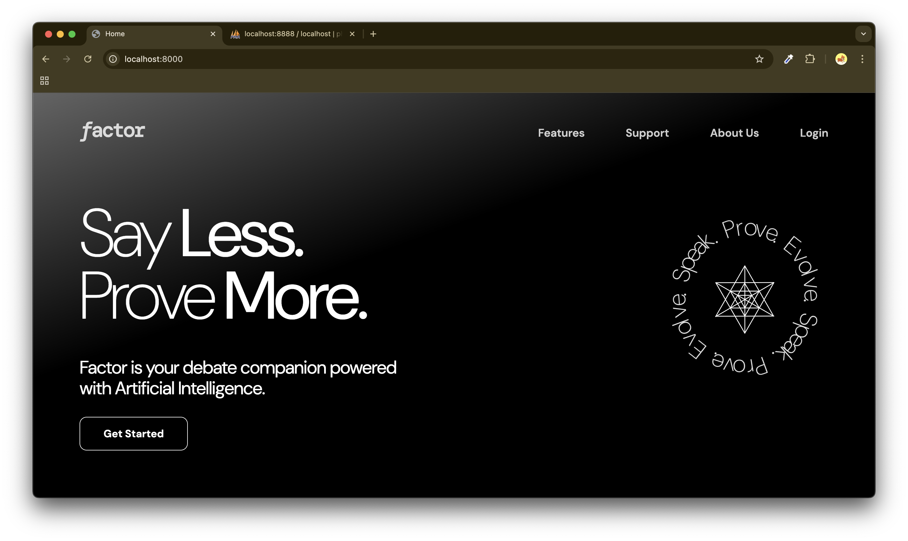
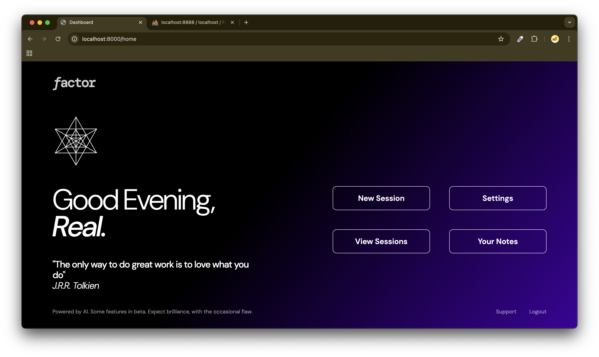
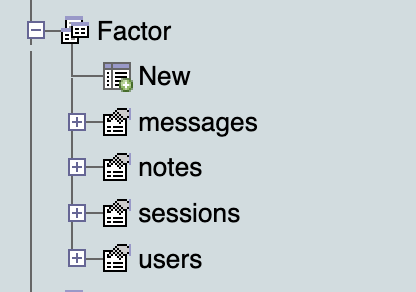
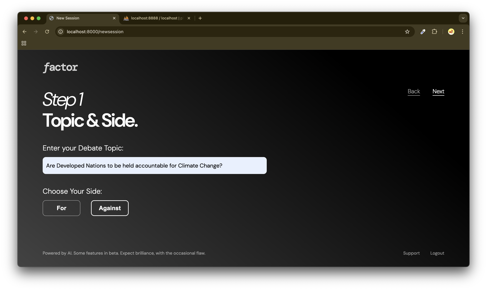
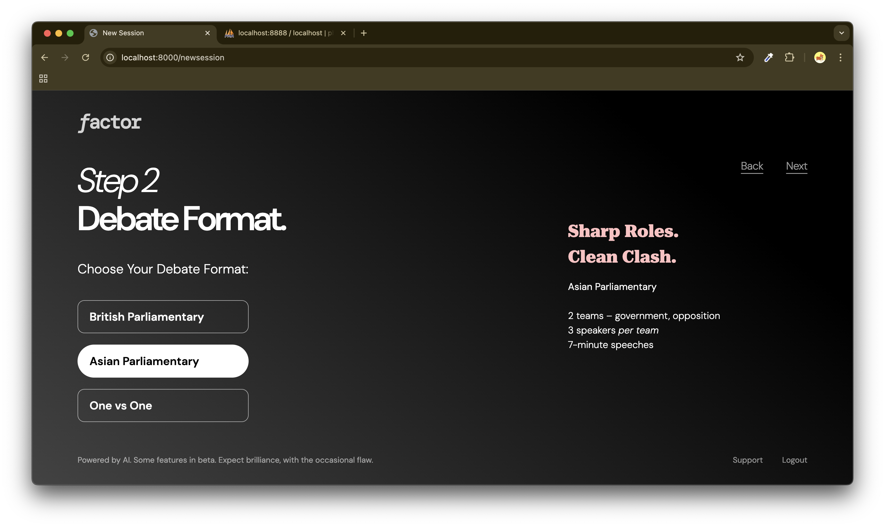
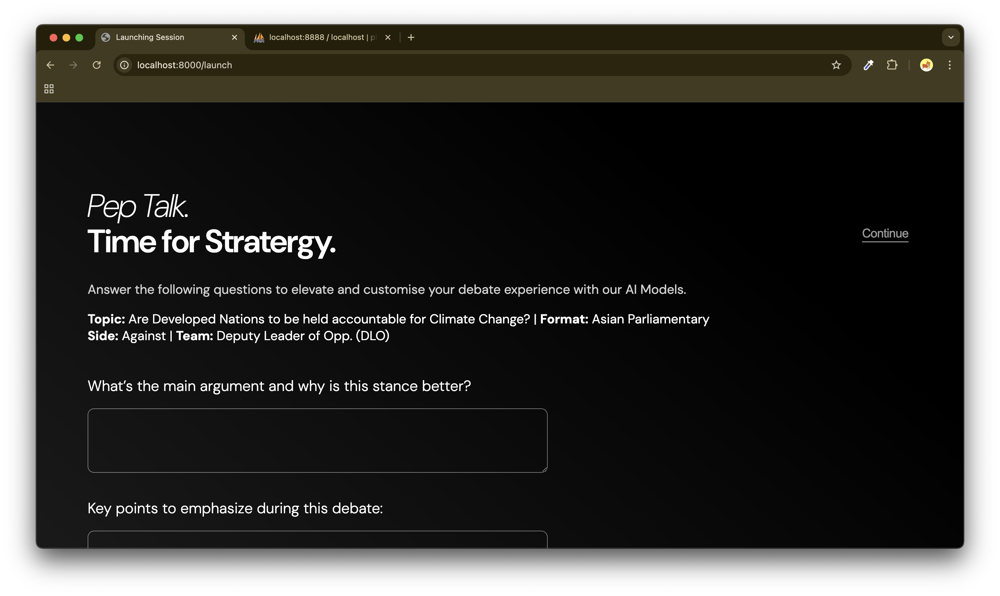
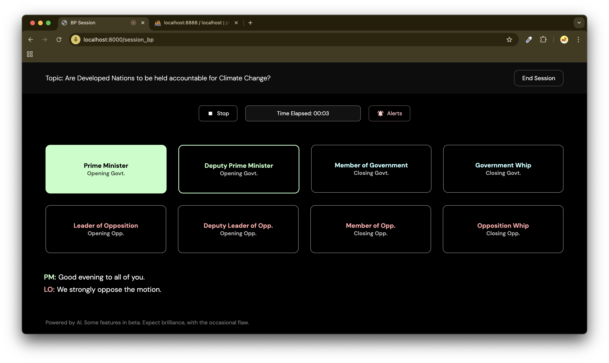

# factor
This is Factor. An AI-powered debating platform to train you and teach you from a lot of different settings. I mean you got to
Factor every point, every argument, every value in a debate - hence the name Factor to give the user a good preparation setup designed for clarity
and efficiency. It allows user to pick roles/teams in a debate and the other side(s) are simulated by AI Model(s) and in the end a judge decides
which one was better in the debate.

Currently in Development.

This project has been build with **FastAPI, HTML, CSS, Javascript** and we are using **Gemini Flash 2.0** to generate responses.
The data storage is mainly done through **SQL database** and in some cases the **text files.**
I am using things like TTS (text to speech), Speech to text and other amazing stuff.

This also utilises **Local Sessions** as a way to store and transmit data

Also while testing, MAMP server on Mac was used for MySQL and simultaneously the FastAPI server was also running on another port. Hence, to set this up locally, it will require both servers. I hope to solve this with deploying on replit through their own SQL services.
So what has been done here, We have variety of pages served through FastAPI. And there are multiple format options among various other settings to create a
new session. Some formats I have taken up are British Parliamentary, Asian Parliamentary and One vs One. Each one having different settings, different number
of roles and teams involved. 

One of they key problems in AI powered things is lack of context. To solve that, I had to introduce **Pep-talk** its basically a set of questions asked just before starting the debate aiming to get the prime objective, and understand what the team is dealing with, their stratergies, dos and don'ts and user has to fill them. This pep-talk thing is passed into our AI models everytime along with the previous speaker (if any)'s transcript to deliver an accurate and fulfilling response through Gemini. There is the use of dynamic color coded roles in the actual debating page.

**Here are some screenshots of the web app:**

So currently, this project is in testing phases, the code shared here will be updated in phases. As of now the code deals with BP
setup with audio integration, TTS conversion of Gemini reply. There are few bugs and features to add (to streamline userflow) which will be done positively in
the coming days. The code right now is a way to note the progress, and other files are currently under testing and will be uploaded after we complete major objectives.

This project will be deployed on Replit in the coming days.
Thank you for reading
Prajwal
(RealJupiter05)

